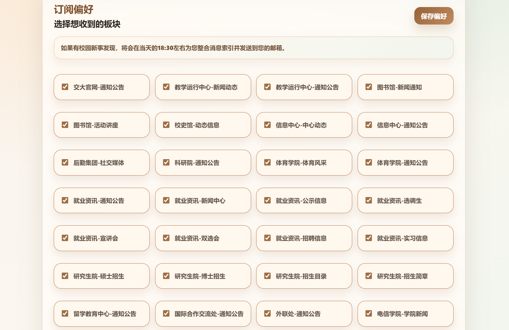

# BJTU Campus News Radar

---

## 一、使用声明与许可证

本项目仅供学习交流和公益实践参考，**禁止任何形式的商业使用**。项目聚合的是公开网页上的信息索引，内容版权归原作者及原网站所有，使用者应遵守目标网站规则、相关法律法规以及学校管理规定。**任何未经授权的商用、滥用、违规部署或由此产生的法律风险，均与项目作者无关。** 

<u>**使用本项目前，请仔细阅读本项目[许可证文件](/LICENSE)**</u>

---

## 二、项目简介

BJTU Campus News Radar 是一个面向北京交通大学校内信息的公益索引与邮件提醒工具。项目会定时扫描已配置的校内公开信息源，识别新增内容并根据用户订阅偏好发送邮件提醒，用户点击邮件卡片后跳转到学校官网查看原文。项目目标并非替代官网，而是帮助同学更及时地发现分散在各站点上的校园新事。

项目前端约90%的代码使用了Vibe Coding，后端代码约40%使用了Vibe Codeing，代码均已进行人工审查。

**目前已有基于本项目部署的公益服务站点，欢迎前往[在线体验](https://radar.uuserver.cn)。**

---

## 三、主要功能

- 多源扫描：通过针对话脚本跟踪与扫描不同站点或栏目。
- 增量识别：使用 SQLite 记录已发现内容，避免重复提醒。
- 邮件通知：按用户偏好过滤板块，只在有关注的新内容时发送。
- Web 登录：支持邮箱验证码登录，带图形验证码、发送冷却和基础频率限制。
- 个性化订阅：用户可选择接收哪些板块，也可随时注销或退订。
- 公益运行保护：支持用户数量上限、每日发送时间提示、管理员异常上报。
- 新板块热加载支持：新增扫描脚本首轮运行结果只入库，不向用户发送历史内容。

---

## 四、页面展示

### 4.1 工作逻辑简图


汇总校园各类讯息的链接索引，通过邮件及时提醒您前往官网查看。

### 4.2 Web首页展示


汇总校园各类讯息的链接索引，通过邮件及时提醒您前往官网查看。

### 4.3 邮件提醒展示


提醒邮件内部页面展示，点击按钮即可跳转至信息源查看。

### 4.4 订阅偏好展示



用户可根据个人需求开启或关闭指定板块的新讯通知。

---

## 五、项目结构

```text
.
├── config.py                    # 公共配置项
├── config_local_example.py      # 本地敏感配置示例
├── runner.py                    # 定时扫描、入库、通知分发入口
├── storage.py                   # SQLite 持久化与去重逻辑
├── email_notifier.py            # 每日通知与管理员异常邮件
├── source_registry.py           # 已启用板块发现逻辑
├── scrape_scripts/              # 各信息源爬虫脚本
├── scripts/                     # 辅助脚本
├── web/                         # Django Web 服务
└── data/                        # 本地运行数据目录
```

---

## 六、本地运行

1. 安装依赖：

```bash
pip install -r requirements.txt
```

2. 复制并填写本地配置：

```bash
copy config_local_example.py config_local.py
copy web\bjtu_notice_site\local_settings_example.py web\bjtu_notice_site\local_settings.py
```

3. 执行一次扫描：

```bash
python runner.py
```

4. 初始化 Web 数据表：

```bash
python manage.py migrate
```

4. 启动 Web 服务：

```bash
python manage.py runserver
```

---

## 七、配置说明

项目总配置文件列表：
- `/config.py`
- `/config_local.py`
Django配置文件列表：
- `/web/bjtu_notice_site/settings.py` 
- `/web/bjtu_notice_site/local_settings.py`

> 为确保项目正常运行，请认真阅读并对配置文件进行配置

---

## 八、协作开发

目前还有很多学院官网的通知板块的扫描脚本暂未开发，工程尚未结束，人手还很缺，欢迎一起补充和维护 `scrape_scripts/scrape_section_*.py`。新增脚本时建议遵守下面的规则：

- 文件命名使用 `scrape_section_*.py`，并放在 `scrape_scripts/` 目录下。
- 每个脚本必须定义 `SECTION_ID` 和 `SECTION_NAME`。
- 每个脚本必须暴露 `crawl()` 函数，返回 `list[ResultSummary]`；异常或结构错误时可返回 `None`。
- 每条结果统一使用 `ResultSummary(section, title, url, date)`。
- URL 应尽量规范成完整链接，标题应去除多余空白，日期保留目标站点原始可读格式即可。
- 单独运行脚本时应能输出调试信息，便于检查每页解析数量、标题、URL 和日期。
- 新脚本写好后，需要在 `config.py` 的 `SOURCE_ADAPTERS` 中显式启用，前端订阅选项才会展示。
- 同一个 `SECTION_NAME` 会在前端去重；如果两个脚本属于同一展示板块，可以使用相同名称。

提交前建议至少运行：

```bash
python -m py_compile scrape_scripts\scrape_section_x.py
python scrape_scripts\scrape_section_x.py
python manage.py check
```

---

## 九、打赏与其他

本项目的开发、维护和线上运行均为公益性质。个人制作不易，且承担较多费用压力，如果你觉得它确实提供了帮助，欢迎自愿打赏任意金额支持项目继续维护；打赏属于自愿赠与，不构成任何购买、会员、服务承诺或商业交易。


如果你希望增加新的校园板块跟踪，或对页面体验、提醒规则、部署方式有改进建议，欢迎提交 issue。请尽量说明目标站点地址、希望跟踪的栏目、页面结构特点以及预期展示名称，这会让后续协作更高效。